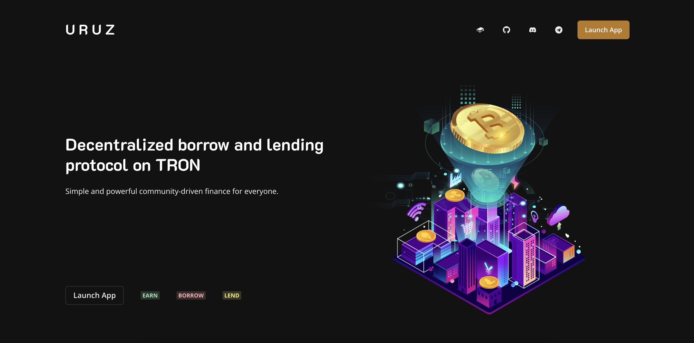
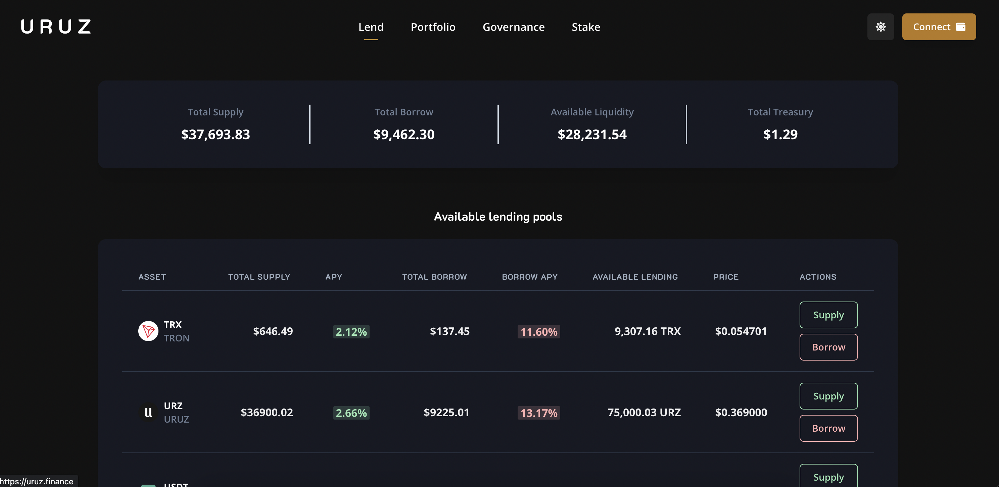
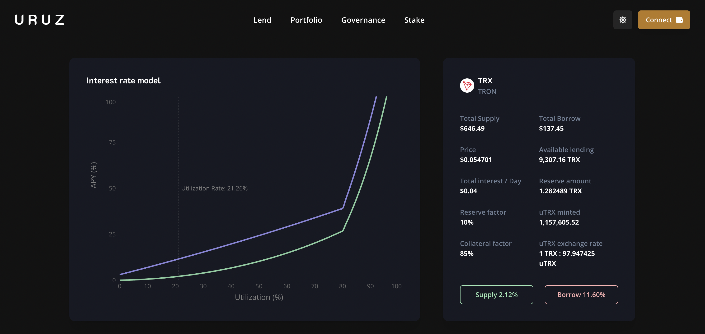
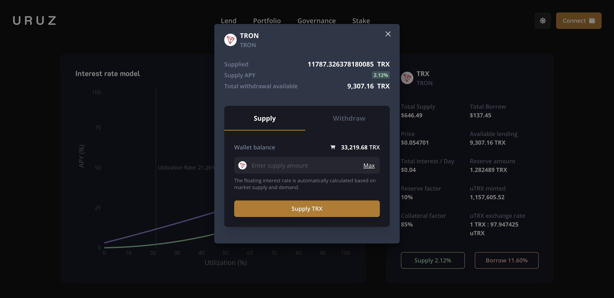
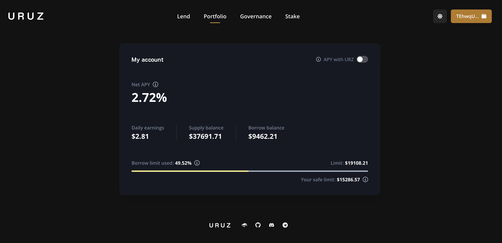
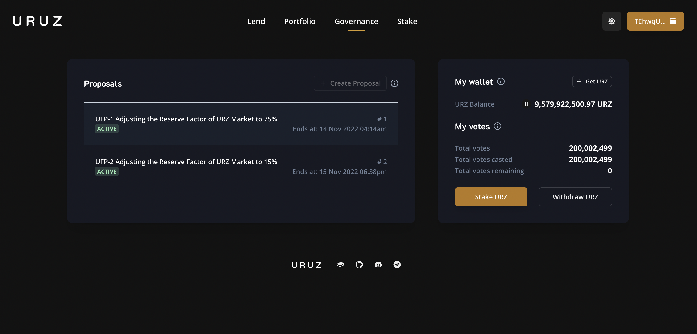
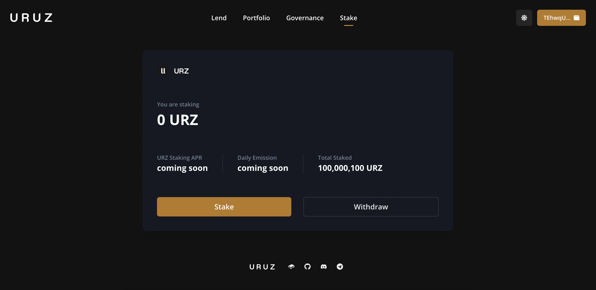

# Uruz Finance

## Overview

Uruz is a decentralized, non-custodial, pool-based interest rates platform that enables users to supply assets to earn interest, and to borrow against them to unlock liquidity.

- [Uruz](https://uruz.finance/)
- [Demo Video](https://youtu.be/yeTxHOR2n44)

### Contract Addresses

Here are the deployed contract addresses:

Comptroller [TPkfi6k8d7yj5WF7CALNLzCWT1ioDaH8qL](https://nile.tronscan.org/#/contract/TPkfi6k8d7yj5WF7CALNLzCWT1ioDaH8qL)

Unitroller [TPBngLaAUtFe9DzqKJri7ziMrS2SRK25XB](https://nile.tronscan.org/#/contract/TPBngLaAUtFe9DzqKJri7ziMrS2SRK25XB)

URZ [TGaxQR6RmfkL9qhZzh8fF83dDLjnJBfVva](https://nile.tronscan.org/#/contract/TGaxQR6RmfkL9qhZzh8fF83dDLjnJBfVva)

USDT-NILE [TXLAQ63Xg1NAzckPwKHvzw7CSEmLMEqcdj](https://nile.tronscan.org/#/contract/TXLAQ63Xg1NAzckPwKHvzw7CSEmLMEqcdj)

WURZ [TFSj9KmFnVg9dUn6NyBeX2EuSFKeKvHyPT](https://nile.tronscan.org/#/contract/TFSj9KmFnVg9dUn6NyBeX2EuSFKeKvHyPT)

GovernorAlpha [TMCYfGnLv3fwFt3cRpkZr76DgMgGr5jDJb](https://nile.tronscan.org/#/contract/TMCYfGnLv3fwFt3cRpkZr76DgMgGr5jDJb)

Timelock [TSsGkp7EWDV1HdC9tgjsDiobFpJwEYYTYz](https://nile.tronscan.org/#/contract/TSsGkp7EWDV1HdC9tgjsDiobFpJwEYYTYz)

jumpRate TRX JumpRateModelV2 [TCvVDLi9YfuvcMNM8T4WogxDiPkXsEDJVa](https://nile.tronscan.org/#/contract/TCvVDLi9YfuvcMNM8T4WogxDiPkXsEDJVa)

TRX CEther [TGjZXu9amnEfiUy3W8Z1ptxKnTVs6cb9vv](https://nile.tronscan.org/#/contract/TGjZXu9amnEfiUy3W8Z1ptxKnTVs6cb9vv)

URZ CErc20Delegate [TS5aDYKwCZNVyVVQBnRUUnbfU9N7Q9isCY](https://nile.tronscan.org/#/contract/TS5aDYKwCZNVyVVQBnRUUnbfU9N7Q9isCY)

URZ CErc20Delegator [TByuWrmpZQb5yYYtWBrT4Kfhzz3jJ1GQ4E](https://nile.tronscan.org/#/contract/TByuWrmpZQb5yYYtWBrT4Kfhzz3jJ1GQ4E)

USDT CErc20Delegate [TB171o3UoyWxwnLABM7yDKtVeFSDyAKTt2](https://nile.tronscan.org/#/contract/TB171o3UoyWxwnLABM7yDKtVeFSDyAKTt2)

USDT CErc20Delegator [TSauT3GhxXhVCUT2hkNRXdNAAr7xTzYsNs](https://nile.tronscan.org/#/contract/TSauT3GhxXhVCUT2hkNRXdNAAr7xTzYsNs)

PriceOracle [TMDVSLJ4gmzxmZ87YDLeVBsxQizf9aSFaA](https://nile.tronscan.org/#/contract/TMDVSLJ4gmzxmZ87YDLeVBsxQizf9aSFaA)

PriceOracleProxy [TP5e3UYcczAy4djF6GpLBCF1KzSDnxwaho](https://nile.tronscan.org/#/contract/TP5e3UYcczAy4djF6GpLBCF1KzSDnxwaho)

UruzLens [TB7ictoxTENyjCA2RmDwN8XfF635zZthfF](https://nile.tronscan.org/#/contract/TB7ictoxTENyjCA2RmDwN8XfF635zZthfF)

ProposalUrzCollateralFactor [TQZp7zvXC5vKyvYgNjR34c4TEEtMrUfTC5](https://nile.tronscan.org/#/contract/TQZp7zvXC5vKyvYgNjR34c4TEEtMrUfTC5)

## Screenshots

**Landing Page**

**Markets**

**Market Details**

**Supply**

**Portfolio**

**Governance**

**Stake**

